# 🌍 Global Layoffs Data Analysis — MySQL

## Overview

This project explores a global layoffs dataset using **MySQL** to identify patterns, trends, and key insights surrounding workforce reductions across companies, industries, countries, and time periods.

The analysis focuses on transforming raw layoffs data into meaningful information through SQL-based data exploration and aggregation.

## 🛠️ Tools & Technologies

* **MySQL**
* SQL
* MySQL Workbench
* Global Layoffs Dataset

## 📊 Analysis Performed

The project covers several aspects of the dataset, including:

* Data cleaning and preparation
* Handling missing and NULL values
* Company-level layoffs analysis
* Industry-level analysis
* Aggregation using `SUM()`, `MAX()`, and other functions
* Filtering and grouping data
* Identifying companies with the highest layoffs
* Analyzing layoffs across different time periods
* Exploring trends and patterns within the dataset

---

# 🔎 SQL Analysis

## 1. Total Layoffs by Company

The first analysis groups the dataset by company and calculates the total number of layoffs associated with each organization.

### SQL Query

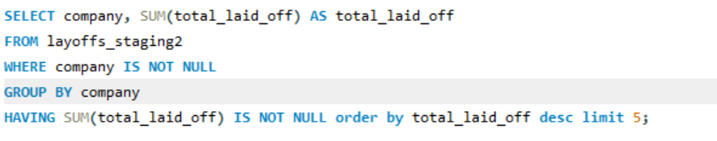

### Result

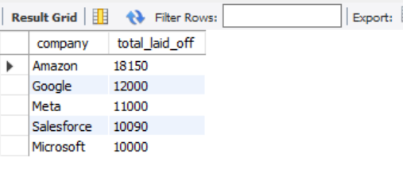

---

## 2. [Analysis from Query 2]

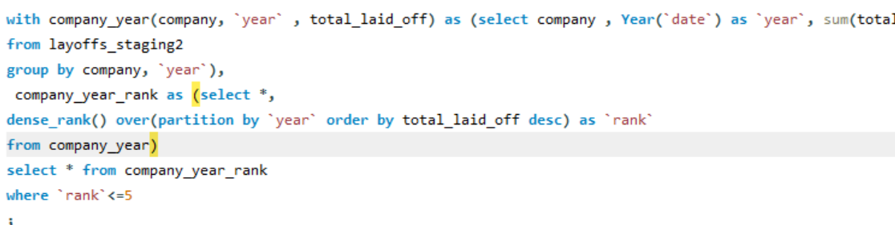

### Result

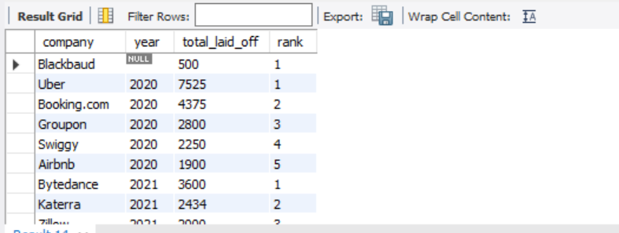

---

## 3. [Analysis from Query 3]

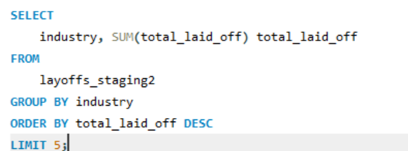

### Result

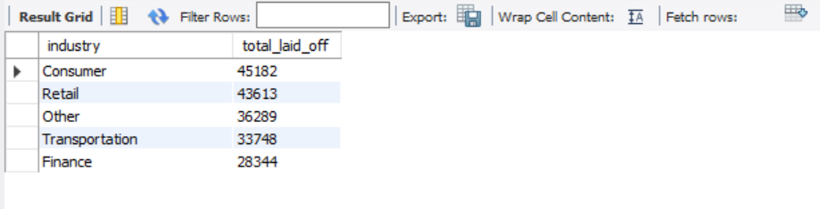

---

## 4. [Analysis from Query 4]


### Result

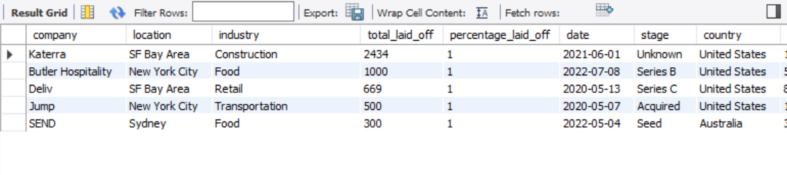

---

## 5. [Analysis from Query 5]

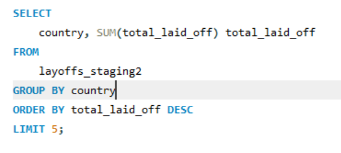

### Result

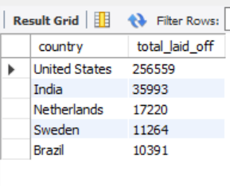

---

## 7. [Analysis from Query 7]

> **Note:** Queries 6 and 6r are not included because the analysis moved directly from Query 5 to Query 7.

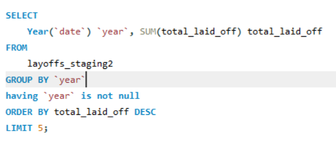

### Result

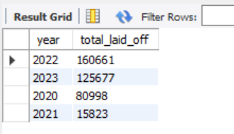

---

## 8. [Analysis from Query 8]

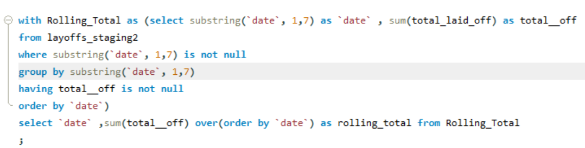

### Result

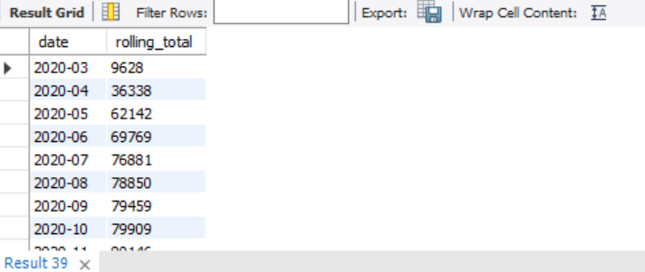

---

# 📌 Key SQL Concepts Used

Throughout the analysis, the project uses several important SQL techniques:

```sql
SELECT
FROM
WHERE
GROUP BY
HAVING
ORDER BY
SUM()
COUNT()
MAX()
MIN()
```

The analysis also demonstrates the distinction between **row-level filtering with `WHERE`** and **group-level filtering with `HAVING`**, particularly when working with aggregate functions.

---

# 🎯 Project Objective

The goal of this project was not simply to query the dataset, but to use SQL as an analytical tool to investigate a real-world business dataset and extract useful patterns from it.

---

# 📂 Dataset

The project uses a global layoffs dataset containing information about layoffs across companies and different periods.

---

# 🚀 Future Improvements

Potential extensions to this analysis include:

* Building a Power BI dashboard from the cleaned dataset
* Performing deeper time-series analysis
* Comparing layoffs across industries and countries
* Identifying companies with recurring layoffs
* Combining SQL analysis with Python/Pandas for further exploration

---

## 👤 Author

**Syed Sami Ullah**

Data Analytics | SQL | Python | Pandas | Excel | Power BI

[GitHub](https://github.com/SyedSamiUllah1)
